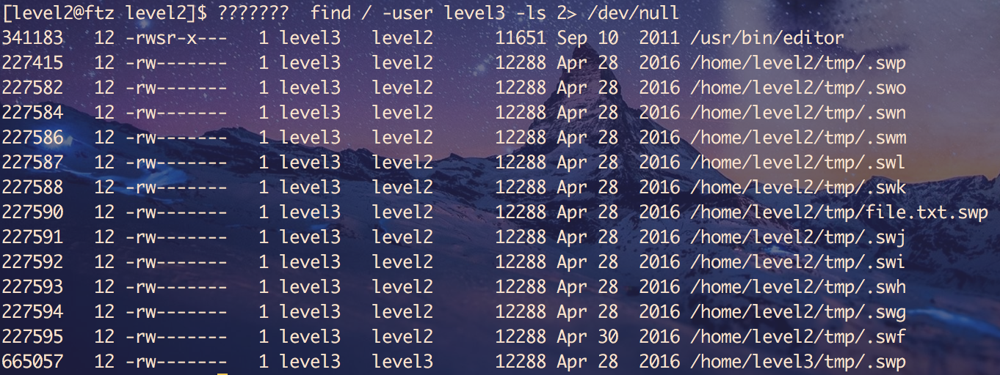
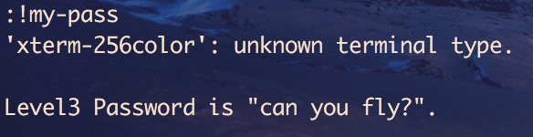

# hackerschool ftz2

[toc]

## editor?

에디터에서 쉘을 실행시킬 수 있다고 한다.

에디터의 권한 설정이 잘못되어 있나보다.

vi 에디터를 이용하면 level3권한이 설정된 스왑파일이 생성되는 걸 보니 뭔가 수상하긴 한가보다.

특히 editor이라는 녀석이 수상하다.

해당 바이너리를 실행하고 쉘 (`:!my-pass`)을 이용해보니 답이 나온다.

