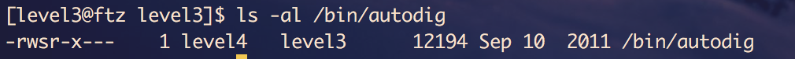
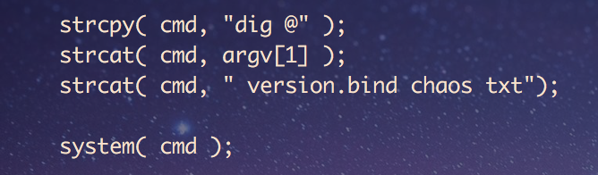
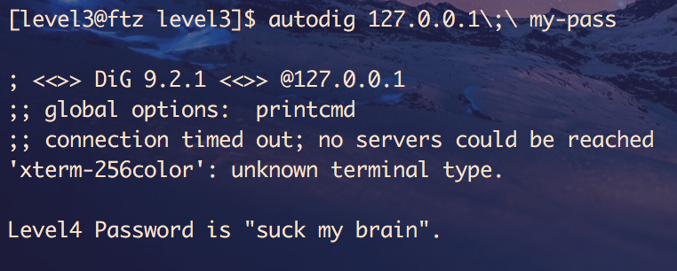

# hackerschool ftz-3

[toc]

## walkthrough

autodig 프로그램을 이용해 암호를 알아내는 문제이다.

autodig 프로그램은 level4에 setuid가 되어있다.

autodig 프로그램은 cmd 스트링에 명령어들을 모아둔 뒤, system 함수로 명령어를 수행하는 방식을 이용하고 있다.

위와 같이 ;를 이용해 여러 명령어를 스트링에 넣을 수 있다.