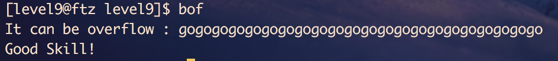
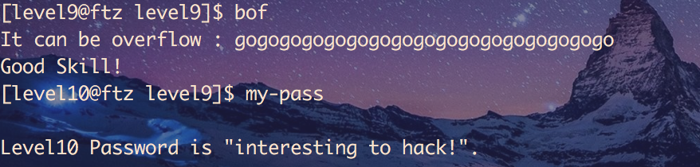

# Hackerschool - ftz09

## walkthrough

코드를 살펴보면 굳이 ret 영역을 덮어 쓸 필요가 없는 것을 알 수 있다.
더미 데이터가 얼마나 들어가는지 또한 알 필요가 없다.

가능한 경우의 수는 `ogogogogogogogogogogogogogog` 혹은 `googogogogogogogogogogogog`두가지 뿐이므로 전수공격을 한다.

